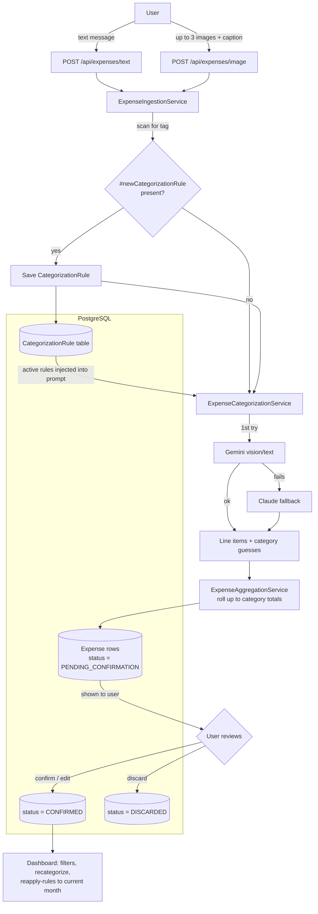
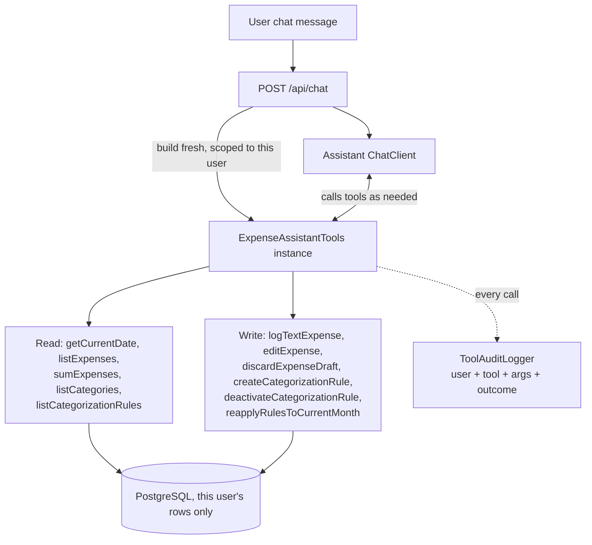

# FinTrack — Phase 1 Backend Flow

Simplified view of expense submission -> categorization -> confirm flow built so far.

**Key rule:** a rule saved from a message is NOT applied to that same message's own expense — `CAT` uses the rule snapshot taken *before* `SAVERULE` runs.

**Key rule:** item-level detail (e.g. "apple 1kg - 100rs") only exists transiently inside `ITEMS` — never written to the DB, only the aggregated category totals in `DRAFT`.

**Key rule:** `ExpenseIngestionService.ingest()` runs the LLM categorization call with no DB
transaction open — a short `prepare` transaction (rule extraction, batch row) runs first, then
the (multi-second, two-provider-fallback) categorization call runs with no connection held at
all, then a short `persist` transaction writes the resulting expense rows. Previously the whole
method was one `@Transactional`, pinning a DB connection for the entire LLM round trip.

There is a second, simpler ingestion path: `ingestManual()` (`POST /api/expenses/manual`) writes
an expense straight to `CONFIRMED` with no LLM call and no batch — used when the user types the
exact category themselves (the layout skins' "quick log" affordances) instead of describing the
purchase for the assistant to categorize.

## Bulk recategorization (`reapplyRulesToCurrentMonth`)

`ExpenseRecategorizationService` re-runs active rules against the current month's confirmed
expenses. Like ingestion, the per-expense LLM suggestion calls run with no DB transaction open —
a short transaction reads the candidate expenses first, the LLM calls run in parallel (bounded to
8 concurrent) outside any transaction, then a short transaction applies the recategorizations.
Previously this was N sequential LLM calls inside one open transaction.

## Frontend

React + Vite SPA in `frontend/`, built by `frontend-maven-plugin` and copied into
`target/classes/static` at `generate-resources` (before `compile`/`test`/`package`) — the
built jar is the only deployable artifact, no separate frontend host. No client-side router —
neither layout skin below uses URL routes, both are internal view state. PWA via
`vite-plugin-pwa` (installable manifest + service worker, `NetworkOnly` for `/api/**`).

**Two layout skins, toggled live.** The app ships two structurally different UIs for the same
data — "Rail Bento" (icon-rail nav, bento-grid dashboard, FAB quick-log) and "Command Feed"
(command-bar chat/search, date-grouped activity feed, slide-out filters/rules drawer) — switched
at runtime by a floating pill (`layouts/LayoutSwitcher.tsx`), persisted to
`localStorage["fintrack:layout"]`. Both skins are real components against the live API, not
mockups; only their JSX/CSS differ. CSS is scoped per skin (`.skin-rail-bento` /
`.skin-command-feed` root classes, `rb-`/`cf-` prefixed class names) so both stylesheets can be
bundled together without colliding.

- `design/` — the business logic shared by both skins: `useDrafts`, `useChat`,
  `useDashboardData` (filters/pagination/aggregates), `useRules`, `categorySeriesIndex`
  (deterministic category→palette-slot index, each skin maps it into its own hex palette), and
  `auth.ts` (logout). Neither skin talks to `api/client.ts` for shared state directly — they go
  through these hooks, so the two UIs can never drift on what a given action actually does.
- `layouts/rail-bento/` — `RailNav` (chat/dashboard + logout), `ChatView` (message thread +
  inline confirm cards for `PENDING_CONFIRMATION` drafts), `DashboardView` (total/donut/trend/
  filters/rules/table bento cells), `QuickLogModal` (Manual tab → `ingestManual`, Photo tab →
  image ingestion, both reachable from a FAB).
- `layouts/command-feed/` — `TopBar` (command bar doubles as chat input, stat-pill strip, a
  photo-attach icon), `Feed` (date-grouped merge of real confirmed expenses + client-side chat
  exchanges + pending drafts), `FiltersRulesDrawer` (search/category chips/rules/reapply/logout,
  slide-out).
- **Global loading bar** (`layouts/LoadingBar.tsx`): every `api.*` call and the chat stream is
  instrumented once, in `api/client.ts`, through a tiny pub-sub in-flight counter
  (`api/loadingStore.ts` + `design/useApiLoading.ts`) — a slim indeterminate bar at the top of
  the page shows automatically for any backend request, no per-call-site wiring. Dashboard/feed
  views also track `initialLoading` so the first load shows "Loading…" instead of a misleading
  empty state.
- Auth: still Spring Security's own default `/login` form + session cookie — no custom React
  login page. CSRF token read from the `XSRF-TOKEN` cookie and echoed as `X-XSRF-TOKEN` on
  every mutating request (`api/client.ts`).
- Dev: `npm run dev` (Vite on 5173) proxies `/api/**` to the Spring Boot app on 8080.

## Conversational assistant tool access (/api/chat)

The general chat endpoint can now answer questions like "how much did I spend on fruits in the
last 3 days" and act on the user's data directly, via one auditable tool per action:

**Key rule:** every tool method checks `expense.getOwner() == this user` (or `rule.getOwner()`)
itself before touching a row — one user's chat can never read or mutate another user's data.

**Key rule:** there is no "confirm expense" tool. The assistant can create/edit/discard drafts,
manage rules, and reapply rules — but finalizing a draft into a real spend record always requires
the human to click confirm in the app, never the LLM acting alone.

**Key rule:** the system prompt (`assistant.system-prompt`) scopes the assistant to FinTrack
expense-tracking tasks only — any off-topic request (general knowledge, unrelated tasks) is
declined regardless of phrasing. This is a prompt-level instruction, not a mechanical filter;
the `SafeGuardAdvisor` blocked-phrase list (`assistant.guardrail.blocked-phrases`) is a separate,
narrower backstop against known prompt-injection phrasings.
