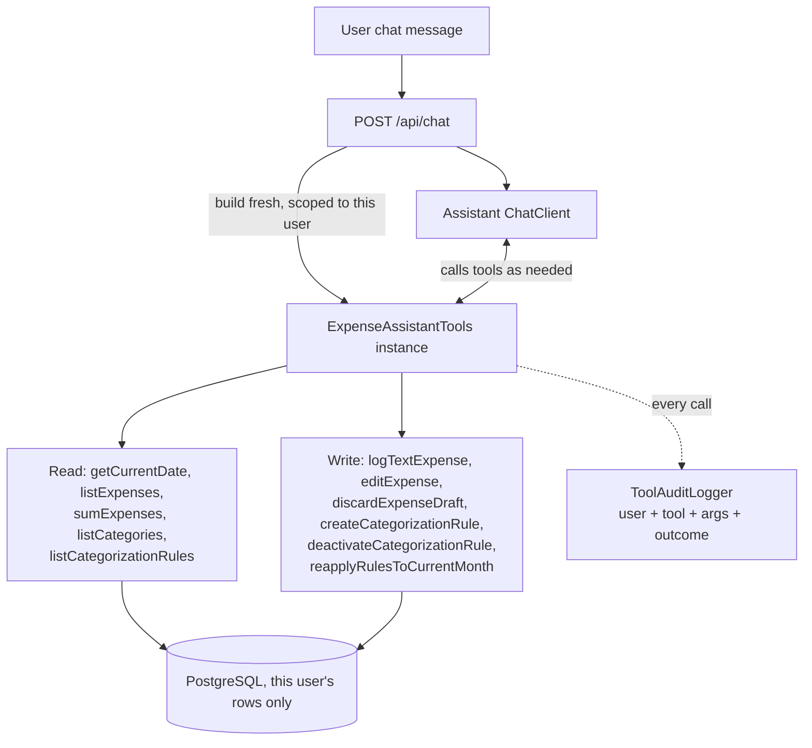

# FinTrack — Phase 1 Backend Flow

Simplified view of expense submission -> categorization -> confirm flow built so far.

**Key rule:** a rule saved from a message is NOT applied to that same message's own expense — `CAT` uses the rule snapshot taken *before* `SAVERULE` runs.

**Key rule:** item-level detail (e.g. "apple 1kg - 100rs") only exists transiently inside `ITEMS` — never written to the DB, only the aggregated category totals in `DRAFT`.

## Frontend (Phase 2)

React + Vite + Tailwind SPA in `frontend/`, built by `frontend-maven-plugin` and copied into
`target/classes/static` at `generate-resources` (before `compile`/`test`/`package`) — the
built jar is the only deployable artifact, no separate frontend host. `HashRouter` is used
(`/#/dashboard`) specifically so a hard refresh never needs server-side SPA-fallback routing.
PWA via `vite-plugin-pwa` (installable manifest + service worker, `NetworkOnly` for `/api/**`).

- `ChatPage` — explicit Chat / Log Expense toggle; expense mode sub-toggles Text / Photo (≤3
  images, client-side previews); any `PENDING_CONFIRMATION` draft is fetched on load so it
  survives a refresh, and `ExpenseConfirmationModal` is the only place a draft becomes
  `CONFIRMED` — never automatic.
- `DashboardPage` — `FilterPanel` (every filter dimension the API exposes), `ExpenseTable`
  with click-to-recategorize, `CategoryBarChart` / `MonthlyTrendChart` (plain SVG/CSS, no chart
  library; stable category→color mapping so filtering never repaints a still-visible category),
  `ReapplyRulesButton`, `RulesPanel`.
- Auth: still Spring Security's own default `/login` form + session cookie — no custom React
  login page. CSRF token read from the `XSRF-TOKEN` cookie and echoed as `X-XSRF-TOKEN` on
  every mutating request (`api/client.ts`).
- Dev: `npm run dev` (Vite on 5173) proxies `/api/**` to the Spring Boot app on 8080.

## Conversational assistant tool access (/api/chat)

The general chat endpoint can now answer questions like "how much did I spend on fruits in the
last 3 days" and act on the user's data directly, via one auditable tool per action:

**Key rule:** every tool method checks `expense.getOwner() == this user` (or `rule.getOwner()`)
itself before touching a row — one user's chat can never read or mutate another user's data.

**Key rule:** there is no "confirm expense" tool. The assistant can create/edit/discard drafts,
manage rules, and reapply rules — but finalizing a draft into a real spend record always requires
the human to click confirm in the app, never the LLM acting alone.
