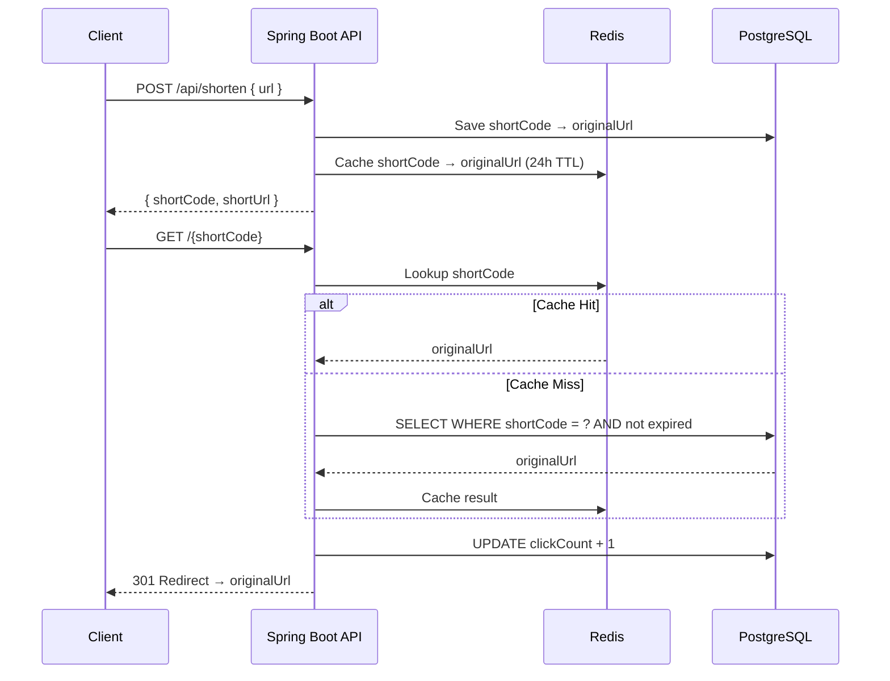

# URL Shortener

A URL shortening service built with Spring Boot 3, PostgreSQL, and Redis.

## How it works



## Notes

- Short codes are Base62, 6 characters (56 billion combinations)
- Redis is used as an L1 cache so redirects don't always hit the DB
- Click count is updated directly via `UPDATE` to avoid race conditions
- Expiry is checked in the query so expired rows are never returned
- Multi-stage Docker build keeps the final image smaller

## API

### Shorten a URL
```
POST /api/shorten
Content-Type: application/json

{
  "url": "https://www.example.com/some/very/long/path",
  "customAlias": "my-link",   // optional
  "ttlDays": 30               // optional, null = never expires
}
```

**Response `201 Created`:**
```json
{
  "shortCode": "my-link",
  "shortUrl": "http://localhost:8080/my-link",
  "originalUrl": "https://www.example.com/some/very/long/path",
  "createdAt": "2024-03-23T10:00:00",
  "expiresAt": "2024-04-22T10:00:00"
}
```

### Redirect
```
GET /{shortCode}
→ 301 Moved Permanently (Location: originalUrl)
```

### Stats
```
GET /api/stats/{shortCode}
```
```json
{
  "shortCode": "my-link",
  "originalUrl": "https://www.example.com/...",
  "clickCount": 42,
  "createdAt": "2024-03-23T10:00:00",
  "expiresAt": "2024-04-22T10:00:00"
}
```

## Running Locally

### With Docker
```bash
git clone https://github.com/YOUR_USERNAME/url-shortener.git
cd url-shortener
docker compose up --build
```

Service is available at `http://localhost:8080`.

### Without Docker
1. Start PostgreSQL on port 5432 with database `urlshortener`
2. Start Redis on port 6379
3. Run:
```bash
./mvnw spring-boot:run
```

## Tests
```bash
./mvnw test
```
Uses H2 in-memory — no external services needed.

## Stack
- Java 17 + Spring Boot 3.2
- PostgreSQL 16
- Redis 7
- JPA / Hibernate
- Docker + docker-compose
- JUnit 5 + MockMvc
