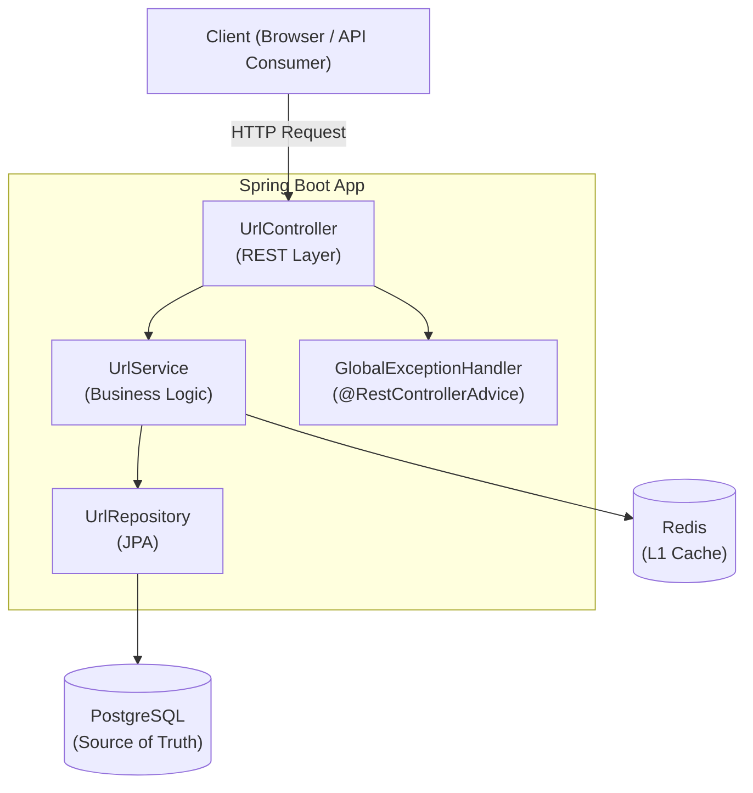
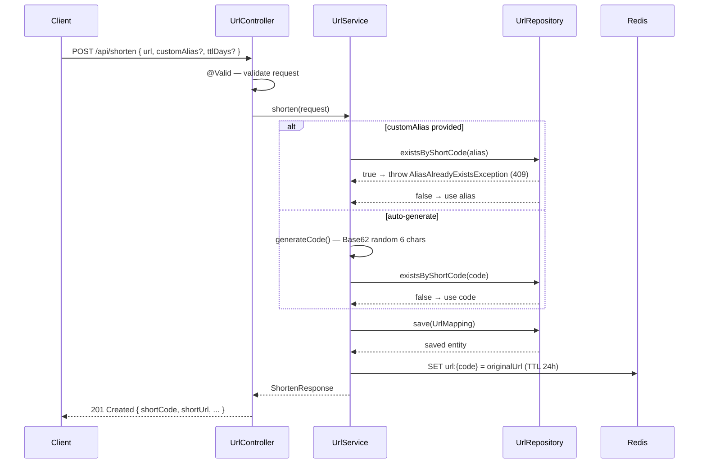
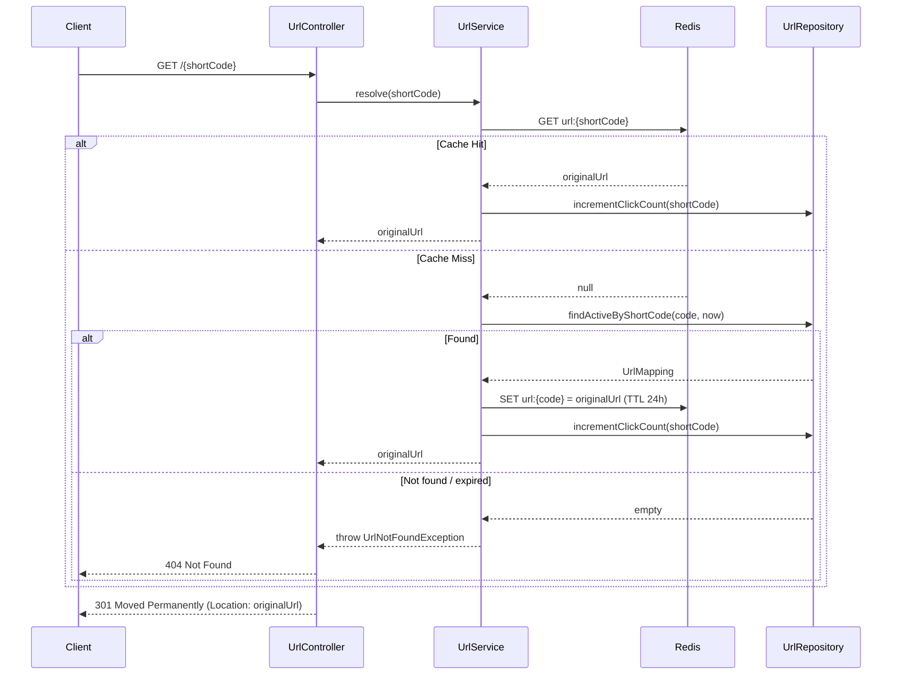
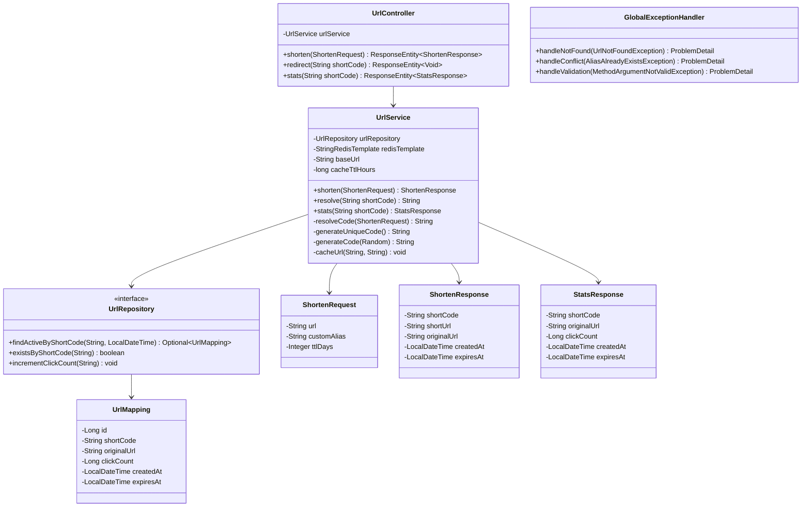

# Low Level Design — URL Shortener

## 1. System Overview

The service has three responsibilities:
1. **Shorten** — accept a long URL, persist a short code, return the short URL
2. **Redirect** — resolve a short code to the original URL and issue a 301
3. **Stats** — return click count and metadata for a short code

---

## 2. Component Diagram



---

## 3. Layer Responsibilities

| Layer | Class | Responsibility |
|-------|-------|---------------|
| Controller | `UrlController` | Parse HTTP request, validate input (`@Valid`), delegate to service, return HTTP response |
| Service | `UrlService` | Code generation, cache read/write, DB read/write, click count increment |
| Repository | `UrlRepository` | JPA queries — find active URL, check existence, atomic click increment |
| Model | `UrlMapping` | JPA entity — maps to `url_mappings` table |
| DTOs | `ShortenRequest`, `ShortenResponse`, `StatsResponse` | API contract — decoupled from DB model |
| Exceptions | `UrlNotFoundException`, `AliasAlreadyExistsException` | Domain errors — mapped to HTTP status by `GlobalExceptionHandler` |

---

## 4. Database Schema

### Table: `url_mappings`

| Column | Type | Constraints | Notes |
|--------|------|-------------|-------|
| `id` | `BIGSERIAL` | PRIMARY KEY | Auto-incremented surrogate key |
| `short_code` | `VARCHAR(10)` | NOT NULL, UNIQUE | The generated or custom alias |
| `original_url` | `VARCHAR(2048)` | NOT NULL | The destination URL |
| `click_count` | `BIGINT` | NOT NULL, DEFAULT 0 | Incremented on each redirect |
| `created_at` | `TIMESTAMP` | NOT NULL | Set by `@PrePersist`, never updated |
| `expires_at` | `TIMESTAMP` | NULLABLE | NULL = never expires |

### Index

```sql
CREATE UNIQUE INDEX idx_short_code ON url_mappings(short_code);
```

`short_code` is the hot lookup path (every redirect hits it) — must be indexed.

### Key SQL queries

```sql
-- Resolve (used on every redirect)
SELECT * FROM url_mappings
WHERE short_code = ?
  AND (expires_at IS NULL OR expires_at > NOW());

-- Atomic click increment (no read-modify-write, no race condition)
UPDATE url_mappings
SET click_count = click_count + 1
WHERE short_code = ?;
```

---

## 5. Redis Cache Design

| Key pattern | Value | TTL |
|-------------|-------|-----|
| `url:{shortCode}` | `originalUrl` (plain string) | 24 hours (configurable) |

### Why `StringRedisTemplate` over `@Cacheable`

`@Cacheable` is simpler but less transparent — you can't control key format or TTL per entry.
`StringRedisTemplate` gives explicit control: exact key names, exact TTL, easy to inspect via `redis-cli`.

### Cache flow

```
GET /{shortCode}
       │
       ▼
  Redis.get("url:{shortCode}")
       │
  ┌────┴────────────────┐
  │ HIT                 │ MISS
  ▼                     ▼
return value        DB query
                        │
                        ▼
                   Redis.set (24h TTL)
                        │
                        ▼
                    return value
```

Both paths → `UPDATE click_count + 1` in DB.

---

## 6. Short Code Generation Algorithm

### Character set — Base62

```
a-z  (26) + A-Z  (26) + 0-9  (10) = 62 characters
```

Only URL-safe characters — no encoding needed in the path.

### Code length — 6 characters

```
62^6 = 56,800,235,584  (~56 billion combinations)
```

At 1,000 new URLs/second, codes run out in ~1,800 years — more than sufficient.

### Generation flow

```
generateUniqueCode()
       │
       ▼
  pick 6 random chars from Base62
       │
       ▼
  existsByShortCode(code)?
       │
  ┌────┴───────┐
  │ NO         │ YES (collision)
  ▼            ▼
return code   retry (max 5 attempts)
                    │
              if 5 failures → throw IllegalStateException
```

**Collision probability** with 56B combinations and 1M existing codes:

```
P(collision) = 1,000,000 / 56,800,235,584 ≈ 0.0018%
```

Practically zero — the retry loop is a safety net, not a common path.

### Custom alias

If `customAlias` is provided in the request:
- Skip generation
- Check `existsByShortCode(alias)` — throw `AliasAlreadyExistsException` (409) if taken
- Use alias directly as the short code

---

## 7. API Contract

### `POST /api/shorten`

**Request:**
```json
{
  "url": "https://example.com/long/path",   // required
  "customAlias": "my-link",                  // optional, 3–10 chars, alphanumeric/_/-
  "ttlDays": 30                              // optional, null = never expires
}
```

**Validation rules (Bean Validation):**

| Field | Rule |
|-------|------|
| `url` | Not blank, must match `^https?://.+`, max 2048 chars |
| `customAlias` | Optional, 3–10 chars, matches `^[a-zA-Z0-9_-]*$` |
| `ttlDays` | Optional integer |

**Response `201 Created`:**
```json
{
  "shortCode": "my-link",
  "shortUrl": "http://localhost:8080/my-link",
  "originalUrl": "https://example.com/long/path",
  "createdAt": "2024-03-23T10:00:00",
  "expiresAt": "2024-04-22T10:00:00"
}
```

---

### `GET /{shortCode}`

**Response:** `301 Moved Permanently` with `Location: {originalUrl}` header

301 is intentional — browsers and CDNs cache permanent redirects, reducing load on the service for repeat visits.

---

### `GET /api/stats/{shortCode}`

**Response `200 OK`:**
```json
{
  "shortCode": "my-link",
  "originalUrl": "https://example.com/long/path",
  "clickCount": 42,
  "createdAt": "2024-03-23T10:00:00",
  "expiresAt": "2024-04-22T10:00:00"
}
```

---

## 8. Error Handling

All errors return RFC 7807 `ProblemDetail` JSON — consistent structure across all error types.

| Scenario | Exception | HTTP Status | Example response |
|----------|-----------|-------------|-----------------|
| Short code not found or expired | `UrlNotFoundException` | `404 Not Found` | `{ "detail": "No active URL found for code: xyz" }` |
| Custom alias already taken | `AliasAlreadyExistsException` | `409 Conflict` | `{ "detail": "Custom alias already taken: my-link" }` |
| Invalid request body | `MethodArgumentNotValidException` | `400 Bad Request` | `{ "detail": "url: URL must start with http:// or https://" }` |

---

## 9. Sequence Diagrams

### 9.1 Shorten



### 9.2 Redirect



---

## 10. Class Diagram



---

## 11. Design Decisions & Trade-offs

| Decision | Alternative Considered | Why This Was Chosen |
|----------|----------------------|---------------------|
| Random Base62 code | Hash of URL (MD5/SHA) | Hash collides when same URL shortened twice; random avoids this cleanly |
| Redis `StringRedisTemplate` | `@Cacheable` annotation | Explicit control over key format, TTL, and inspectability via `redis-cli` |
| `301 Permanent Redirect` | `302 Temporary Redirect` | 301 is cached by browsers — repeat visits don't hit the server at all |
| Atomic `UPDATE click_count + 1` | Read → increment → save | Read-modify-write has a race condition under concurrent requests |
| Expiry checked in JPQL query | Checked in Java after fetch | Filtering at DB level avoids loading a row only to discard it |
| `ProblemDetail` (RFC 7807) | Custom error DTO | Standard format — clients can handle errors generically |
| H2 for tests | Testcontainers (real Postgres) | H2 is faster and needs no Docker in CI; Testcontainers is better for dialect-specific features |
